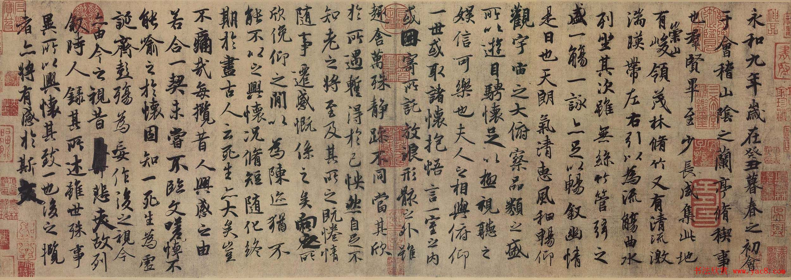
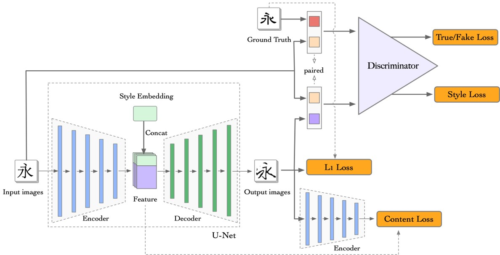
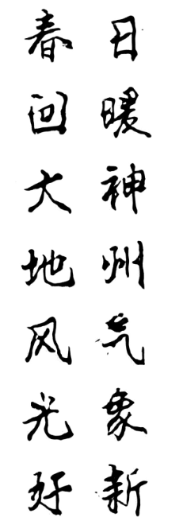
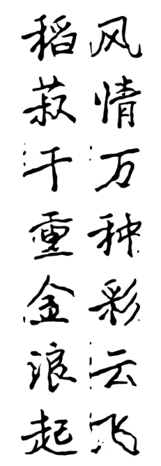
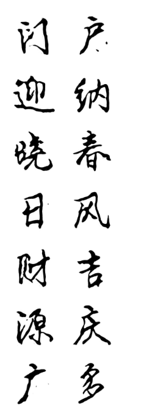
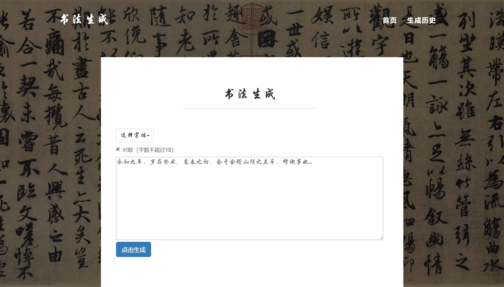
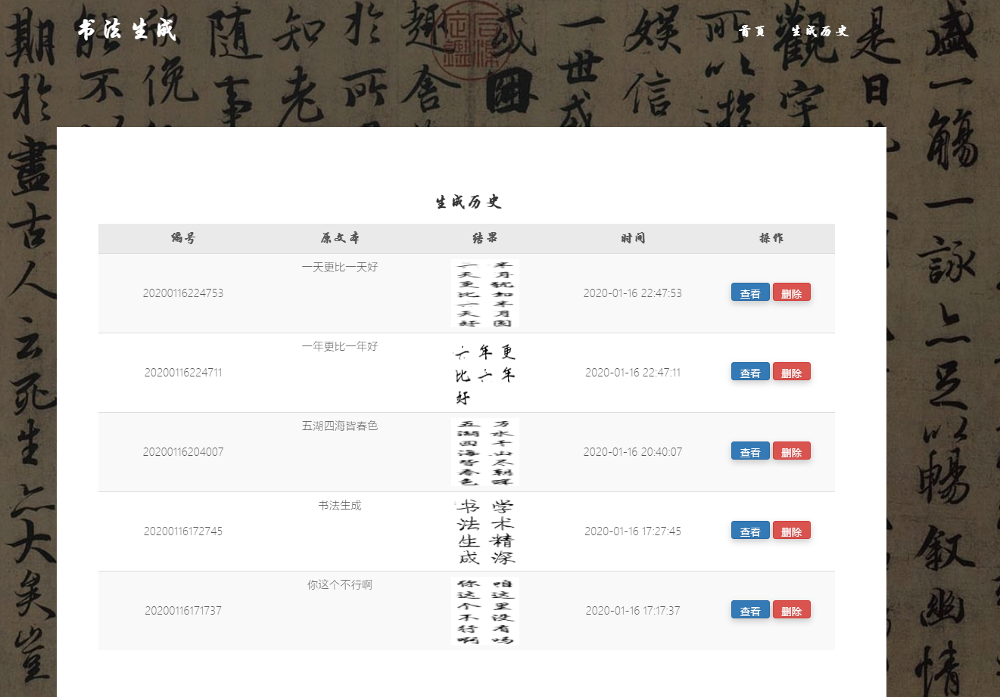

# GoogleML-Calligraphy

* [Overview](#overview)
* [OurCalligraphy](#OurCalligraphy)
* [Result](#Result)
* [Reference](#Reference)

## overview
Picture Style-Transfer is a tough problem in Computer Vision, which attracts lots attention in the recent decade. Different with the previous Style-Transfer for scenery pictures, we focus more on the Style-Transfer for Chinese Calligraphy Words.

## OurCalligraphy
To solve the problem probably, we design a GAN-based model, which consists of two parts, a U-Net based Generator and a CNN-based Discriminator. 
Moreover, to enable multi-style transfer, we concatenate the encoded feature with embedding of the target style, and feed the mixed feature into decoder.
To enhanced the capability of generator in the in-domain dataset (etc. Lanting Jixu), we first train our model by adversarial learning in the out-domain dataset, which consist of nearly 50k Chinese Calligraphy pictures with different styles and fine-tune in a in-domain dataset.

### Network Structure

To display the generated result visually, we build a Chinese Calligraphy Generating (CCG) System., which is mainly based on Django, which enable users to generate specific style of Chinese Calligraphy for a certain text.
To extend the application of our Chinese Calligraph Generating System, we even train a auto couplet generator based on Transformer, which could given a reasonable couplet, paired to the given one. 
CCG will transfer the generated couplets into a certain style of  Chinese Calligraph, just like how human do in real world.

## Result
The reconstruction result of Lanting Jixu generated by our model:

Couplet generated by our model:

Here are some system screenshots

## Reference

* [zi2zi](https://github.com/pcgreat/zi2zi) by [pcgreat](https://github.com/pcgreat)
* [AGIS-Net](https://github.com/hologerry/AGIS-Net) by [hologerry](https://github.com/hologerry)
* [HCCG-CycleGAN](https://github.com/changebo/HCCG-CycleGAN) by [changebo](https://github.com/changebo)

* [pix2pix-tensorflow](https://github.com/yenchenlin/pix2pix-tensorflow) by [yenchenlin](https://github.com/yenchenlin)
* [Domain Transfer Network](https://github.com/yunjey/domain-transfer-network) by [yunjey](https://github.com/yunjey)
* [ac-gan](https://github.com/buriburisuri/ac-gan) by [buriburisuri](https://github.com/buriburisuri)
* [dc-gan](https://github.com/carpedm20/DCGAN-tensorflow) by [carpedm20](https://github.com/carpedm20)
* [origianl pix2pix torch code](https://github.com/phillipi/pix2pix) by [phillipi](https://github.com/phillipi)

我太难了